### 1. pandas

보통 많이 접하는 데이터의 형태는 엑셀의 스프레드시트 같은 로우와 컬럼으로 구성된 테이블 형태이다. **pandas** 는 테이블 형태의 데이터를 쉽게 다룰 수 있는 파이썬 라이브러리이다.

`import pandas as pd` 를 작성하여 판다스를 불러오고 별칭을 지칭하여 준다.

---


### 2. 데이터 불러오기 (pd.read_excel)

```python
sample_1 =
pd.read_excel('./files/sample_1.xlsx')
```

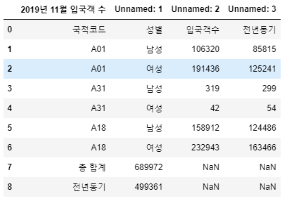

**`pd.read_excel`**을 사용하여 폴더안의 엑셀 파일을 불러왔다. 다음은 옵션을 설정해본다.

```python
sample_1 = pd.read_excel('./files/sample_1.xlsx',
                        header=1, # 1번째 행이 헤더(인덱스)
                        usecols='A:C', # 이 컬럼만 사용
                        skipfooter=2,   # 밑에서부터 2개를 뺀다
                        names=['A','B','C']) # 컬럼 네임 변경
sample_1
```

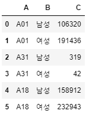

옵션에 맞춰서 출력이 된다. 데이터 분석에 있어서 원하는 정보만을 추출하고 싶을 때나 가독성을 높이기 위해 사용한다. 그런데 데이터 분석을 하다보면 데이터 타입이 문제되는 경우가 있다. 때문에 데이터 타입을 변환 하거나 삭제하는 등의 조치를 취해야 한다. `sample_1.dtypes`을 작성하여 데이터 타입을 확인해보자.

```python
sample_1.dtypes
>>>
A    object
B    object
C     int64
dtype: object
```

'C' 컬럼의 데이터 타입이 int인데 이를 float로 변환하고 싶다. pd.read_excel 함수의 옵션에 아래의 코드를 작성해주면 된다.

```python
sample_1 = pd.read_excel(dtype={'C':np.float64})  # C 컬럼의 모든 값을 실수로 변환
sample_1.dtypes
>>>
A     object
B     object
C    float64
dtype: object
```

실수로 변환되었음을 알 수 있다.

---


### 3. 데이터 통합하기

커뮤니케이션의 효율성이나, 관리의 용이함 때문에 데이터를 통합한다. 데이터를 통합하는 경우는 크게 두 가지 경우로 구분할 수 있다.

1. 두 데이터를 **옆으로 통합**하는 경우
2. 형태가 같은 여러 데이터를 **아래로 통합**하는 경우


#### 1. **옆으로 통합**

- **먼저 다음과 같은 `sample_1 데이터`를 다시 불러와 보자**

```python
sample_1 = pd.read_excel('./files/sample_1.xlsx', header=1,skipfooter=2)
sample_1['기준년월'] = '2019-11'
sample_1
```

> 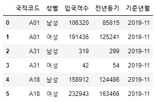

위의 실행 결과와 같이 국적이 코드로 표현되어 있어 어느 나라인지 파악이 불가능하다. 때문에 *국적코드*와 *국적명*을 매핑해 놓은 **국적코드표**를 통해 *국적코드*에 해당하는 *국적명*을 추가(혹은 변환) 한 후 데이터 분석을 진행해보자.

- **국적 코드표가 저장된 파일을 불러온다.**

```python
code_master = pd.read_excel('./files/sample_codemaster.xlsx')
code_master
```

> 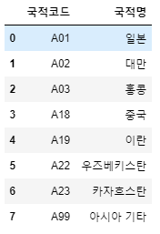


- **`pd.merge()` 함수를 이용하여 sample_1 데이터에 code_master 데이터를 추가한다.**

```python
sample_1_code = pd.merge(left=sample_1, 		# 왼쪽 테이블은 sample_1
                         right=code_master,		# 오른쪽 테이블은 ~
                         how='left',			# 왼쪽 테이블을 기준으로 
                         left_on='국적코드',	  # 왼쪽 테이블의 기준 컬럼은 '국적코드'다
                         right_on='국적코드')	  # 오른쪽 테이블의 ~
sample_1_code
```

>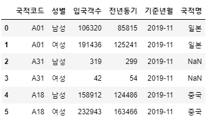

`merge 함수`는 기준 테이블과 정보를 결합하고 싶은 테일블 간에 공통된 칼럼('국적코드')에 대해 같은 값을 찾아서 결합해 하나의 테이블로 합치는 역할을 한다.

**NaN** 값이 발생한 이유는 **code_master**의 국적코드에는 A31이 존재하지 않기 때문이다. 왼쪽 테이블(sample_1)을 기준으로 통합했기 때문에 오른쪽 테이블의 국적코드에 매칭되는 값이 없는 경우에는 **NaN**값으로 결과가 출력된다.

만약 양쪽 테이블에서 공통으로 존재하는 경우에 대해 출력하고 싶다면 기준 옵션을**(how='inner')**로 설정해주면 된다.

> 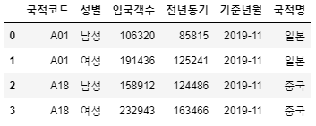


#### 2. **아래로 통합**

- **먼저 다음과 같은 `sample_2 데이터`를 만들어 보자**

```python
sample_2 = pd.read_excel('./files/sample_2.xlsx', 
                         header=1, 
                         skipfooter=2, 
                         usecols='A:C')
sample_2['기준년월']='2019-12'
sample_2_code = pd.merge(left=sample_2, 
                         right=code_master,
                         how='left',
                         left_on='국적코드',
                         right_on='국적코드')
sample_2_code
```

> 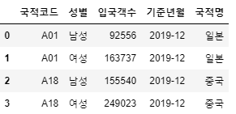


데이터를 아래로 통합하기 위해선 컬럼 순서가 동일해야 한다. 위에서 생성한 **sample_1_code**를 다시 보자.

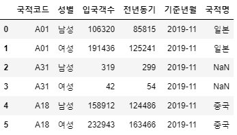

`전년동기` 컬럼이 하나 더 있는데, 이 컬럼을 삭제해준다.

```python
sample_1_code = sample_1_code.drop(['전년동기'],axis=1)
```

그렇다면 두 데이터의 컬럼 순서가 동일한 것을 확인했으니 `pd.append()`함수를 써서 두 데이터를 아래로 통합해본다.


- **pd.append()를 사용하여 아래로 통합**

```python
sample = sample_1_code.append(sample_2_code, ignore_index=True)
sample
```

> 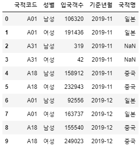

두 데이터를 **sample_1_code** 기준으로 통합했다. 이때 **ignore_index=True** 를 지정하지 않으면 원래 각 데이터에서의 인덱스 값으로 합쳐지므로 일반적으로 이 인자를 지정하길 권장한다.

---


### 4. 데이터 저장(to_excel)

- 생성한 `sample` 데이터를 엑셀 파일로 저장한다.

  ```python
  sample.to_excel('./files/sample_class.xlsx')
  ```

  > 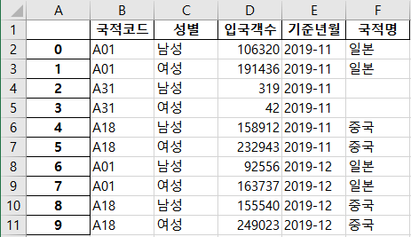

위와 같이 엑셀파일이 저장되었고, A 셀은 pandas에서 자동 생성된 인덱스 번호이다. 다음은 옵션을 추가해보자.

```python
sample.to_excel('./files/sample_class.xlsx',
               index=False,							# False로 설정하면 인덱스 번호가 제거된다.
               na_rep='NaN',sheet_name='my_sheet')	# 결측값을 설정값으로 치환, 시트 네임 설정
```

> 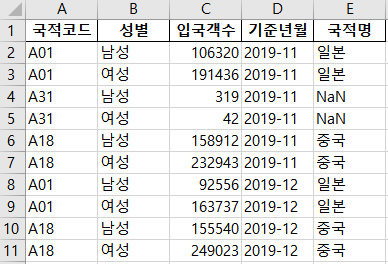


- 다른 코드를 사용하여 작성할 수도 있다.

  ```python
  with pd.ExcelWriter('./files/sample_class.xlsx') as writer:
                 sample.to_excel(writer, sheet_name = 'my sheet 1')
                 sample.to_excel(writer, sheet_name = 'my sheet 2',
                                        index=False,
                                         na_rep='NaN')
  ```

---


### 5. 데이터 집계(pivot_table)

피벗 테이블이란 기존 데이터의 컬럼을 재구성해서 데이터에 대한 통계를 한눈에 파악할 수 있게 정리한 표를 의미한다. **피벗 기능을 이용하면 데이터를 원하는 형태로 손쉽게 집계할 수 있다.**

- **sample 데이터**를 통해 피벗 테이블을 만들어 보자. *국적*과 *기준년월*에 따른 *입국객수*의 **평균값**을 구해보자.

```python
sample_pivot = sample.pivot_table(values='입국객수',	# 피벗 테이블 내부에 들어갈 값()
                                  index='국적명',		 # 피벗 테이블 로우에 배치(엑셀에서 행)
                                  columns='기준년월',   # 피벗 테이블 컬럼에 배치(엑셀에서 열)
                                  aggfunc='mean' )	  # values를 index와 columns 기준으로 해당 식을 계산
sample_pivot
```

> 

피벗 테이블 함수에서는 **`values`,`index`,`columns`,`aggfunc`**를 사용한다. **index**와 **columns**은 항상 있어야 하는 것은 아니다. 필요에 의해 index만  배치할 경우라면 columns 값을 지정하지 않아도 된다. 

**`aggfunc`**에는 다음과 같은 옵션을 적용할 수 있다.

| 함수명      | 설명                                 |
| ----------- | ------------------------------------ |
| mean        | 평균                                 |
| sum         | 합계                                 |
| min         | 최솟값                               |
| median      | 중앙값                               |
| max         | 최댓값                               |
| count       | 개수                                 |
| **nunique** | **중복을 제거한 후 개수(원소 개수)** |

